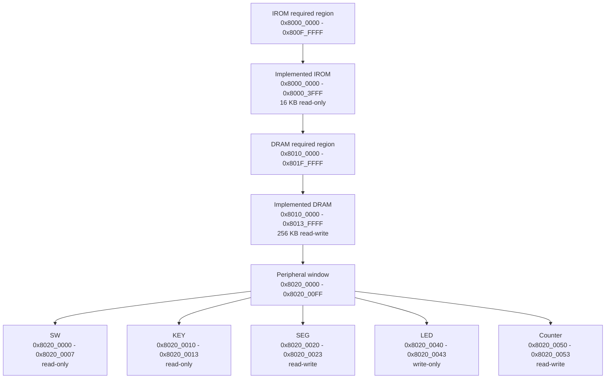

# Memory Map

This document summarizes the contest-facing address map already documented in
`README.md` and `docs/competition-spec.md`. It does not add additional
unverified memory regions or peripheral behavior.

## Diagram

## Address Table

| Region | Address range | Implemented range | Size | Access | Notes |
| --- | --- | --- | --- | --- | --- |
| IROM | `0x8000_0000` - `0x800F_FFFF` | `0x8000_0000` - `0x8000_3FFF` | 16 KB implemented | Read-only | Contest IROM region with smaller implemented memory |
| DRAM | `0x8010_0000` - `0x801F_FFFF` | `0x8010_0000` - `0x8013_FFFF` | 256 KB implemented | Read-write | Contest DRAM region with smaller implemented memory |
| Peripheral window | `0x8020_0000` - `0x8020_00FF` | Listed MMIO entries below | Not specified | Mixed | Documented peripheral address window |
| SW | `0x8020_0000` - `0x8020_0007` | Same | 8 bytes | Read-only | Switch inputs |
| KEY | `0x8020_0010` - `0x8020_0013` | Same | 4 bytes | Read-only | Key inputs |
| SEG | `0x8020_0020` - `0x8020_0023` | Same | 4 bytes | Read-write | Seven-segment display data |
| LED | `0x8020_0040` - `0x8020_0043` | Same | 4 bytes | Write-only | LED output |
| Counter | `0x8020_0050` - `0x8020_0053` | Same | 4 bytes | Read-write | Performance counter MMIO |

## Counter Commands

The documented counter MMIO address is `0x8020_0050` - `0x8020_0053`.
The contest-facing command values are summarized in `docs/competition-spec.md`:

- Write `0x8000_0000`: start counting.
- Write `0xFFFF_FFFF`: end counting.
